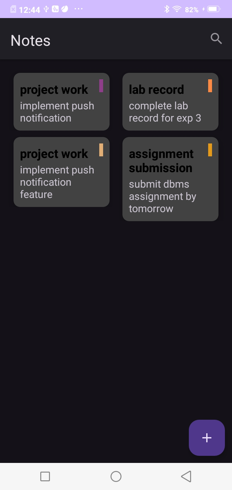
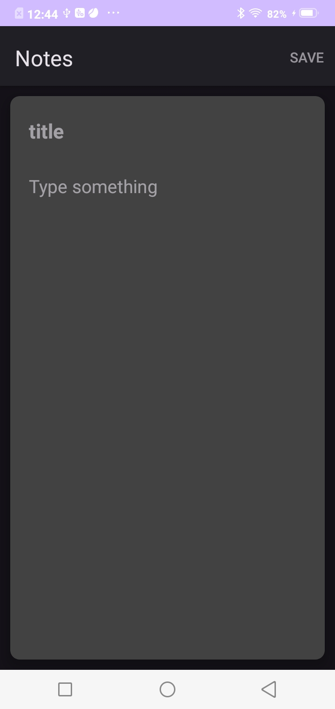
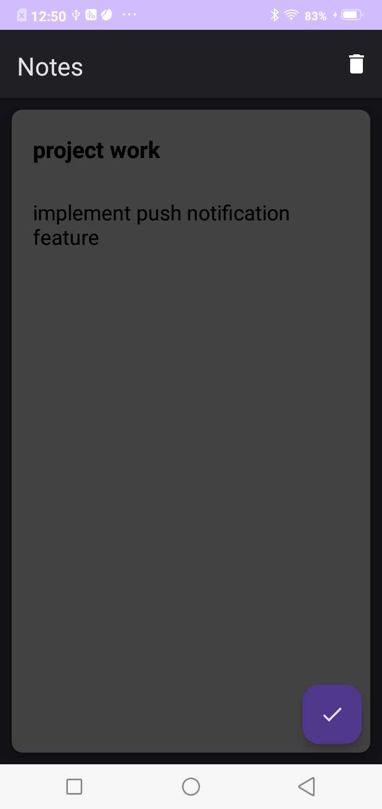

I've built a super simple note-taking app for Android that's perfect for notting down quick thoughts, reminders, or to-do lists. It's got a clean interface and makes it easy to add, edit, and manage your notes.

What can you do with it?

- Add new notes whenever you need to
- Update notes with new info
- Delete notes when you're done with them

Under the hood:

- developed using Android studio
- Uses Room database to store your notes safely
- Navigation Graph makes it easy to move around the app
- Fragments and Adapters help keep everything running smoothly

ScreenShots:

